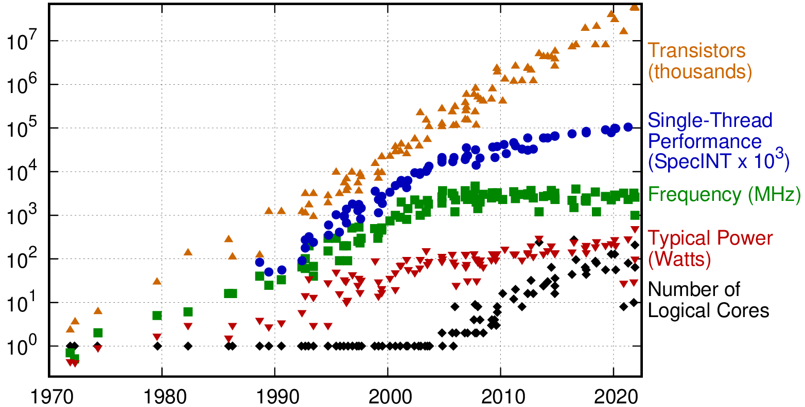

# Introduction {#sec:sec1}

They say, "performance is king". It was true a decade ago, and it certainly is now. According to [@Domo2017], in 2017, the world has been creating 2.5 quintillions[^1] bytes of data every day, and as predicted in [@Statista2018], this number is growing 25% per year. In our increasingly data-centric world, the growth of information exchange fuels the need for both faster software (SW) and faster hardware (HW). Fair to say, the data growth puts demand not only on computing power but also on storage and network systems. 

In the PC era[^2], developers usually were programming directly on top of the operating system, with possibly a few libraries in between. As the world moved to the cloud era, the SW stack got deeper and more complex. The top layer of the stack on which most developers are working has moved further away from the HW. Those additional layers abstract away the actual HW, which allows using new types of accelerators for emerging workloads. However, the negative side of such evolution is that developers of modern applications have less affinity to the actual HW on which their SW is running. 

Software programmers have had an "easy ride" for decades, thanks to Moore’s law. It used to be the case that some SW vendors preferred to wait for a new generation of HW to speed up their application and did not spend human resources on making improvements in their code. By looking at Figure @fig:50YearsProcessorTrend, we can see that single-threaded performance[^3] growth is slowing down.

{#fig:50YearsProcessorTrend width=90%}

When it's no longer the case that each HW generation provides a significant performance boost [@Leisersoneaam9744], we must start paying more attention to how fast our code runs. When seeking ways to improve performance, developers should not rely on HW. Instead, they should start optimizing the code of their applications.

> “Software today is massively inefficient; it’s become prime time again for software programmers to get really good at optimization.” - Marc Andreessen, the US entrepreneur and investor (a16z Podcast, 2020)

\personal{While working at Intel, I hear the same story from time to time: when Intel clients experience slowness in their application, they immediately and unconsciously start blaming Intel for having slow CPUs. But when Intel sends one of our performance ninjas to work with them and help them improve their application, it is not unusual that they help speed it up by a factor of 5x, sometimes even 10x.}

Reaching high-level performance is challenging and usually requires substantial efforts, but hopefully, this book will give you the tools to help you achieve it.

[^1]: Quintillion is a thousand raised to the power of six (10^18^).

[^2]: From the late 1990s to the late 2000s where personal computers where dominating the market of computing devices.

[^3]: Single-threaded performance is a performance of a single HW thread inside the CPU core.
