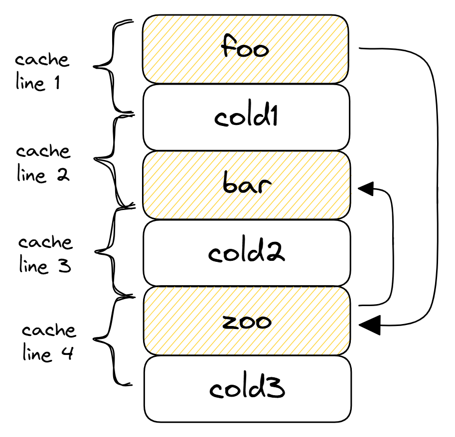
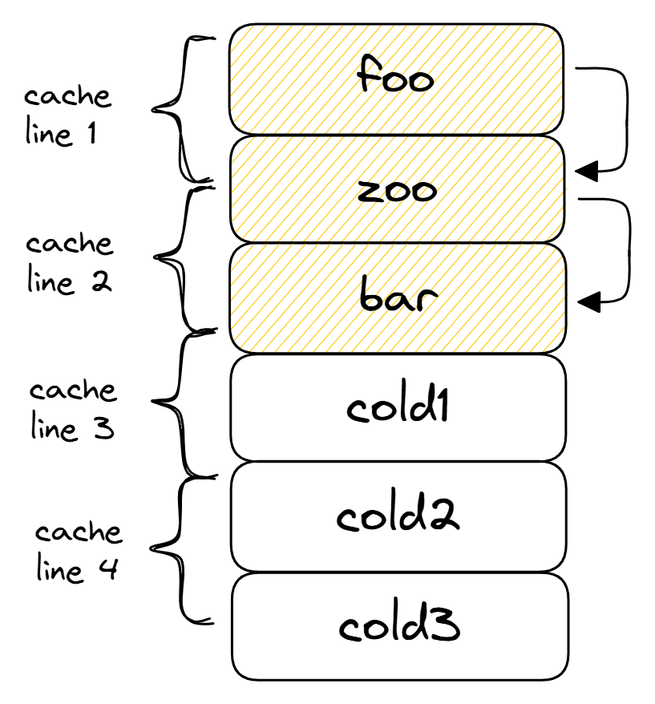

## Function Reordering

Following the principles described in previous sections, hot functions can be grouped together to further improve the utilization of caches in the CPU Front-End. When hot functions are grouped together, they start sharing cache lines, which reduces the *code footprint*, total number of cache lines a CPU needs to fetch.

Figure @fig:FunctionGrouping gives a graphical representation of reordering hot functions `foo`, `bar`, and `zoo`. The arrows on the image show the most frequent call pattern, i.e., `foo` calls `zoo`, which in turn calls `bar`. In the default layout (see Figure @fig:FuncGroup_default), hot functions are not adjacent to each other with some cold functions placed between them. Thus the sequence of two function calls (`foo` -> `zoo` -> `bar`) requires four cache line reads. 

We can rearrange the order of the functions such that hot functions are placed close to each other (see Figure @fig:FuncGroup_better). In the improved version, the code of `foo`, `bar` and `zoo` functions fits in three cache lines. Also, notice that function `zoo` now is placed between `foo` and `bar` according to the order in which function calls are being made. When we call `zoo` from `foo`, the beginning of `zoo` is already in the I-cache.

{#fig:FuncGroup_default width=50%}
{#fig:FuncGroup_better width=50%}

Reordering hot functions.

Similar to previous optimizations, function reordering improves the utilization of I-cache and DSB-cache. This optimization works best when there are many small hot functions. 

The linker is responsible for laying out all the functions of the program in the resulting binary output. While developers can try to reorder functions in a program themselves, there is no guarantee on the desired physical layout. For decades people have been using linker scripts to achieve this goal. Still, this is the way to go if you are using the GNU linker. The Gold linker (`ld.gold`) has an easier approach to this problem. To get the desired ordering of functions in the binary with the Gold linker, one can first compile the code with the `-ffunction-sections` flag, which will put each function into a separate section. Then use [`--section-ordering-file=order.txt`](https://manpages.debian.org/unstable/binutils/x86_64-linux-gnu-ld.gold.1.en.html) option to provide a file with a sorted list of function names that reflects the desired final layout. The same feature exists in the LLD linker, which is a part of LLVM compiler infrastructure and is accessible via the `--symbol-ordering-file` option.

An interesting approach to solving the problem of grouping hot functions together was introduced in 2017 by engineers from Meta. They implemented a tool called [HFSort](https://github.com/facebook/hhvm/tree/master/hphp/tools/hfsort)[^1], that generates the section ordering file automatically based on profiling data [@HfSort]. Using this tool, they observed a 2\% performance speedup of large distributed cloud applications like Facebook, Baidu, and Wikipedia. HFSort has been integrated into Meta's HHVM, LLVM BOLT, and LLD linker[^2]. Since then, the algorithm has been superseded first by HFSort+, and most recently by Cache-Directed Sort (CDSort[^3]), with more improvements for workloads with large code footprint.

[^1]: HFSort - [https://github.com/facebook/hhvm/tree/master/hphp/tools/hfsort](https://github.com/facebook/hhvm/tree/master/hphp/tools/hfsort)

[^2]: HFSort in LLD - [https://github.com/llvm-project/lld/blob/master/ELF/CallGraphSort.cpp](https://github.com/llvm-project/lld/blob/master/ELF/CallGraphSort.cpp)

[^3]: Cache-Directed Sort in LLVM - [https://github.com/llvm/llvm-project/blob/main/llvm/lib/Transforms/Utils/CodeLayout.cpp](https://github.com/llvm/llvm-project/blob/main/llvm/lib/Transforms/Utils/CodeLayout.cpp)