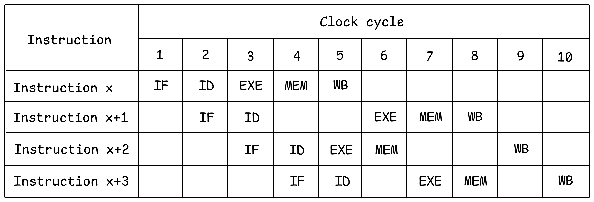
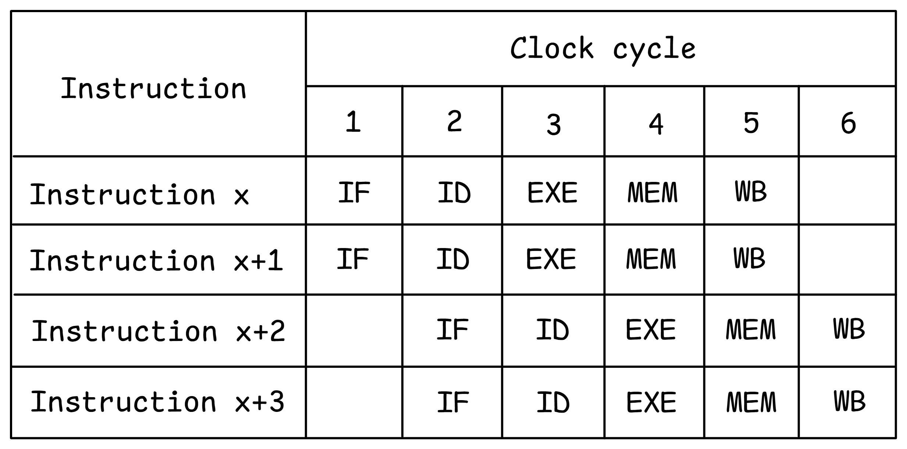

## Exploiting Instruction Level Parallelism (ILP)

Most instructions in a program lend themselves to be pipelined and executed in parallel, as they are independent. Modern CPUs implement a large menu of additional hardware features to exploit such instruction-level parallelism (ILP). Working in concert with advanced compiler techniques, these hardware features provide significant performance improvements. 

### OOO Execution

The pipeline example in Figure @fig:Pipelining shows all instructions moving through the different stages of the pipeline in-order, i.e., in the same order as they appear in the program. Most modern CPUs support out-of-order (OOO) execution, i.e., sequential instructions can enter the execution pipeline stage in any arbitrary order only limited by their dependencies. OOO execution CPUs must still give the same result as if all instructions were executed in the program order. An instruction is called *retired* when it is finally executed, and its results are correct and visible in the [architectural state](https://en.wikipedia.org/wiki/Architectural_state). To ensure correctness, CPUs must retire all instructions in the program order. OOO is primarily used to avoid underutilization of CPU resources due to stalls caused by dependencies, especially in superscalar engines described in the next section. 

Dynamic scheduling of these instructions is enabled by sophisticated hardware structures such as scoreboards and techniques such as register renaming to reduce data hazards. [Tomasulo algorithm](https://en.wikipedia.org/wiki/Tomasulo_algorithm)[^4] implemented in the IBM360 and [Scoreboading](https://en.wikipedia.org/wiki/Scoreboarding)[^5] implemented in the CDC6600 in the 1960s are pioneering efforts to support dynamic scheduling and out-of-order execution that have influenced all modern CPU architectures. The scoreboard hardware is used to schedule the in-order retirement and all machine state updates. It keeps track of data dependencies of every instruction and where in the pipe the data is available. Most implementations strive to balance the hardware cost with the potential return. Typically, the size of the scoreboard determines how far ahead the hardware can look for scheduling such independent instructions. 

{#fig:OOO width=80%}

Figure @fig:OOO details the concept underlying out-of-order execution with an example. Assume instruction x+1 cannot execute in cycles 4 and 5 due to a conflict. An in-order CPU would stall all subsequent instructions from entering the EXE pipeline stage. In an OOO CPU, subsequent instructions that do not have any conflicts (e.g., instruction x+2) can enter and complete its execution. All instructions still retire in order, i.e., the instructions complete the WB stage in the program order.

### Superscalar Engines and VLIW

Most modern CPUs are superscalar i.e., they can issue more than one instruction in a given cycle. Issue-width is the maximum number of instructions that can be issued during the same cycle. Typical issue-width of current generation CPUs ranges from 2 to 6. To ensure the right balance, such superscalar engines also have more than one execution unit and/or pipelined execution units. CPUs also combine superscalar capability with deep pipelines and out-of-order execution to extract the maximum ILP for a given piece of software. 

{#fig:SuperScalar width=55%}

Figure @fig:SuperScalar shows an example CPU that supports 2-wide issue width, i.e., in each cycle, two instructions are processed in each stage of the pipeline. Superscalar CPUs typically support multiple, independent execution units to keep the instructions in the pipeline flowing through without conflicts. In addition to pipelining, replicating execution units further increases the performance of a machine.

Architectures such as the Intel Itanium moved the burden of scheduling a superscalar, multi-execution unit machine from the hardware to the compiler using a technique known as VLIW - Very Long Instruction Word. The rationale is to simplify the hardware by requiring the compiler to choose the right mix of instructions to keep the machine fully utilized. Compilers can use techniques such as software pipelining, loop unrolling, etc. to look further ahead than can be reasonably supported by hardware structures to find the right ILP. 

### Speculative Execution {#sec:SpeculativeExec}

As noted in the previous section, control hazards can cause significant performance loss in a pipeline if instructions are stalled until the branch condition is resolved. One technique to avoid this performance loss is hardware branch prediction logic to predict the likely direction of branches and allow executing instructions from the predicted path (speculative execution).

Let's consider the short code example in @lst:Speculative. For a processor to understand which function it should execute next, it should know whether the condition `a < b` is false or true. Without knowing that, the CPU waits until the result of the branch instruction will be determined, as shown in figure @fig:NoSpeculation. 

Listing: Speculative execution

~~~~ {#lst:Speculative .cpp}
if (a < b)
  foo();
else
  bar();
~~~~~~~~~~~~~~~~~~~~~~~~~~~~~~~~~~~~~~~~~~~~~~~~~

{#fig:NoSpeculation width=60%}

{#fig:SpeculativeExec width=60%}

The concept of speculative execution.

With speculative execution, the CPU takes a guess on an outcome of the branch and initiates processing instructions from the chosen path. Suppose a processor predicted that condition `a < b` will be evaluated as true. It proceeded without waiting for the branch outcome and speculatively called function `foo` (see figure @fig:SpeculativeExec, speculative work is marked with `*`). State changes to the machine cannot be committed until the condition is resolved to ensure that the architecture state of the machine is never impacted by speculatively executing instructions. In the example above, the branch instruction compares two scalar values, which is fast. But in reality, a branch instruction can be dependent on a value loaded from memory, which can take hundreds of cycles. If the prediction turns out to be correct, it saves a lot of cycles. However, sometimes the prediction is incorrect, and the function `bar` should be called instead. In such a case, the results from the speculative execution must be squashed and thrown away. This is called the branch misprediction penalty, which we discuss in [@sec:BbMisp].

To track the progress of speculation, the CPU supports a structure called the reorder buffer (ROB). The ROB maintains the status of all instruction execution and retires instructions in-order. Results from speculative execution are written to the ROB and are committed to the architecture registers, in the same order as the program flow and only if the speculation is correct. CPUs can also combine speculative execution with out-of-order execution and use the ROB to track both speculation and out-of-order execution. 

### Branch Prediction

As we just have seen, correct predictions greatly improve execution as they allow a CPU to make forward progress without having results of previous instructions available. However, bad speculation often incurs costly performance penalties. Modern CPUs employ fairly sophisticated dynamic branch prediction mechanism, which provide very high accuracy and can adapt to dynamic changes in branch behavior. There are three types of branches which could be handled in a special way:

* **Unconditional jumps and direct calls**. They are the easiest to predict as they are always taken and go in the same direction every time.
* **Conditional branches**. Conditional branches have two targets: taken or not taken. Taken branches can go forward or backward. Forward conditional branches are usually generated for `if-else` statements, which have a high chance of not being taken as frequently it represents an error checking code. Backward conditional jumps are frequently seen in loops and used to go to the next iteration of a loop; such branches are usually taken.
* **Indirect calls and jumps**. Indirect branches have many targets. An indirect jump or indirect call can be generated for a `switch` statement, a function pointer, or a `virtual` function. A return from a function deserves attention because it has many potential targets as well.

Most prediction algorithms are based on previous outcomes of the branch. The core of the branch prediction unit (BPU) is a branch target buffer (BTB), which caches the target addresses for every branch. Prediction algorithms consult the BTB to generate the next address to fetch every cycle. The CPU uses that new address to fetch the next block of instructions. If no branches are identified in the current fetch block, the next address to fetch will be the next sequential aligned fetch block (fall through). 

Unconditional branches do not require prediction, we just need to lookup the target address in the BTB. Remember, the BPU needs to generate the next address to fetch every cycle to avoid the pipeline stalls. We could have extracted the address just from the instruction encoding itself, but then we have to wait until the decode stage is over, which will introduce a bubble in the pipeline and make things slower. So, the next fetch address has to be determined at the time when the branch is fetched. 

For conditional branches, we first need to predict whether it will be taken or not. If not taken, then we fall through, no need to lookup the target. Otherwise, we lookup the target address in the BTB. Conditional branches usually account for the biggest portion of total branches and are the main source of misprediction penalties in production software. For indirect branches we need to select one of the possible targets, but the prediction algorithm can be very similar to conditional branches.

All prediction mechanisms try to exploit two important principles, which are similar to what we will discuss with caches later:

* **Temporal correlation**. The way a branch resolves may be a good predictor of the way it will resolve at the next execution. Also know as local correlation.
* **Spatial correlation**. Several adjacent branches may resolve in a highly correlated manner (a preferred path of execution). Also know as global correlation.

The best accuracy is often achieved by leveraging local and global correlation together. So, not only we look at the outcome history of the current branch, but also we correlate it with outcomes of other branches. 

Another common technique used is called hybrid prediction. The idea is that some branches have biased behavior. For example, if a conditional branch goes in one direction 99.9% of the time, there is no need to use complex predictor and pollute its data structures. A much more simpler machanisms can be used. Another example is a loop branch. If a branch has loop behavior, then it can be predicted using a dedicated loop predictor, which will remember the number of iterations the loop typically executes.

Today, state of the art prediction is dominated by TAGE-like [@Seznec2006] or perceptron-based [@Jimenez2001] predictors. Championship[^6] branch predictors make less than 3 mispredictions per 1000 instructions. Modern CPUs routinely reach >95% prediction rate on most workloads.

[^4]: Tomasulo algorithm - [https://en.wikipedia.org/wiki/Tomasulo_algorithm](https://en.wikipedia.org/wiki/Tomasulo_algorithm).
[^5]: Scoreboarding - [https://en.wikipedia.org/wiki/Scoreboarding](https://en.wikipedia.org/wiki/Scoreboarding).
[^6]: 5th Championship Branch Prediction competition - [https://jilp.org/cbp2016](https://jilp.org/cbp2016).