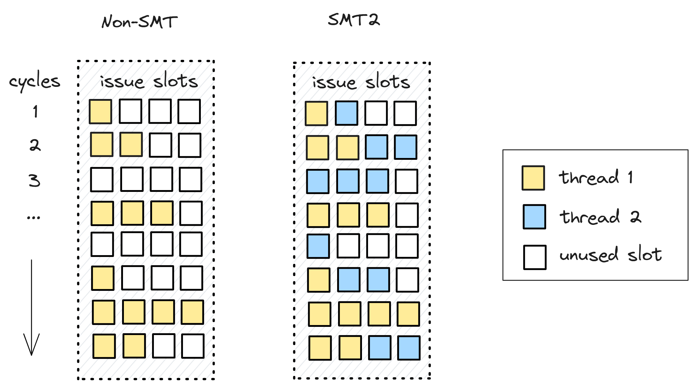

## Exploiting Thread Level Parallelism

[TODO] update

Techniques described previously rely on the available parallelism in a program to speed up execution. In addition, CPUs support techniques to exploit parallelism across processes and/or threads executing on the CPU. A hardware multi-threaded CPU supports dedicated hardware resources to track the state (aka context) of each thread independently in the CPU instead of tracking the state for only a single executing thread or process. The main motivation for such a multi-threaded CPU is to switch from one context to another with the smallest latency (without incurring the cost of saving and restoring thread context) when a thread is blocked due to a long latency activity such as memory references.  

Modern CPUs combine ILP techniques that we explored earlier with several TLP techniques we will discuss next: multicore systems, simultaneous multithreading and hybrid architectures. Such techniques allow to eke out the most efficiency from the available hardware resources.

### Multicore systems

[TODO] to be written

### Simultaneous Multithreading

A more sophisticated approach to improve multithreaded performance is Simultaneous Multithreading (SMT). Very frequently people use the term *Hyperthreading* to describe the same thing. The goal of the technique it is to fully utilize the available width of the CPU pipeline. SMT allows multiple software threads to run simultaneously on the same physical core using shared resources. More precisely, instructions from multiple software threads execute concurrently in the same cycle. Those don't have to be threads from the same process, they can be completely different programs happened to be schedulled on the same physical core. 

An example of execution on a non-SMT and an SMT2 processor is shown in figure @fig:SMT. In both cases the width of the processor pipeline is four, each slot representing an opportunity to issue a new instruction. A 100% machine utilization is when there are no unused slots, which never happens in real workloads. It's easy to see that for the non-SMT case, there are many unused slot, the available resources are not utilized well. It may happen for a variety of reasons, one of the typical reason is a cache miss. At cycle 3, thread 1 cannot make forward progress because it is waiting for data to arrive. SMT processors take this opportunity to schedule useful work from another thread. The goal here is to occupy unused slots by another thread to hide memory latency, improve hardware utilization and multithreaded performance.

{#fig:SMT width=80%}

With a SMT2 implementation, each physical core is represented with two logical cores, which are visible to the operating system as two independent processors available to take work. Consider a situation when we have 16 software threads ready to run, and only 8 physical cores. In a non-SMT system, only 8 threads will run at the same time, while with SMT2 we can execute all 16 threads simultaneously. In another hypothetical situation, if two programs run on a SMT-enabled core and each consistently utilize only two out of four available slots, then there is a high chance they will run as fast as if they would be running alone on that physical core.

Although two programs run on the same processor core, they are completely separated from each other. In an SMT-enabled processor, even though instructions are mixed, they have different context which helps preserve correctness of the execution. To support SMT, a CPU must replicate architectural state (program counter, registers) to maintain thread context. Other CPU resources can be shared. In a typical implementation, cache resources are dynamically shared amongst the hardware threads. Resources to track OOO and speculative execution can either be replicated or partitioned.

In an SMT2 core, both logical cores are truly running at the same time. In the CPU front-end, they fetch instructions in an alternating order (every cycle or a few cycles). In the back-end, each cycle a processor selects instructions for execution from all threads. Instruction execution is mixed as the processor dynamically schedules execution ports among both threads.

So, SMT is a very flexible setup, that allows to recover unused CPU issue slots. SMT provides equal single-thread performance, in addition to its benefits for multiple threads. Modern multi-threaded CPUs support either two-way (SMT2) or four-way (SMT4).

SMT has its own disadvantages as well. Since some resources are shared among the logical cores, they could eventually compete to use those resources. The most typical example of SMT penalty is related to utilization of L1 and L2 caches. Since they are shared between two logical cores, they could lack space in caches and force eviction of the data that will be used by another thread in the future.

SMT brings a considerable burden on software developers as it makes harder to predict and measure performance of an application that runs on an SMT core. Imagine you're running a critical code on an SMT core, and suddenly the OS puts another demanding job on a sibling logical core. Your code nearly maxes out the resources of the machine, and now you need to share it with someone else. This problem is especially pronounced in a cloud environment when you cannot predict whether your application would have noisy neighbors or not.

There is also a security concern with certain simultaneous multithreading implementations. Researchers showed that some earlier implementations had a vulnerability through which it is possible for one application to steal critical information (like cryptographic keys) from another application that runs on the sibling logical core of the same processor by monitoring its cache use. We will not dig deeper into this since it is not a book about HW security.

### Hybrid Architectures

[TODO] to be written