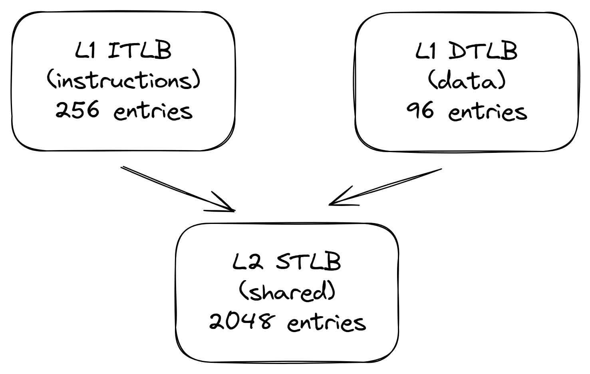

## Modern CPU design

[TODO]: update to GoldenCove uarch.

![Block diagram of a CPU Core in the Intel GoldenCove Microarchitecture. *© Image from [@IntelOptimizationManual].*](../../img/uarch/goldencove_block_diagram.png){#fig:Skylake_diag width=95%}

The block diagram in figure @fig:Skylake_diag shows the details of Intel’s 6th generation core, Skylake, that was announced in 2015 and is widely spread all over the world. The Skylake core is split into an in-order front-end that fetches and decodes x86 instructions into u-ops and an 8-way superscalar, out-of-order backend. 

The core supports 2-way SMT. It has a 32KB, 8-way first-level instruction cache (L1 I-cache), and a 32KB, 8-way first-level data cache (L1 D-cache). The L1 caches are backed up by a unified 1MB second-level cache, the L2 cache. The L1 and L2 caches are private to each core.

### CPU Front-End {#sec:uarchFE}

The CPU Front-End consists of a number of data structures that serve the main goal to efficiently fetch and decode instructions from memory. Its main purpose is to feed prepared instructions to the CPU Back-End, which is responsible for the actual execution of instructions.

The CPU Front-End fetches 16 bytes per cycle of x86 instructions from the L1 I-cache. This is shared among the two threads, so each thread gets 16 bytes every other cycle. These are complex, variable-length x86 instructions. The pre-decode and decode stages of the pipeline convert these complex x86 instructions into micro Ops (UOPs, see [@sec:sec_UOP]) that are queued into the Instruction Decode Queue (IDQ). 

First, the pre-decode determines and marks the boundaries of the variable instructions by inspecting the instruction. In x86, the instruction length can range from 1-byte to 15-bytes instructions. This stage also identifies branch instructions. The pre-decode stage moves up to 6 instructions (also referred to as Macro Instructions) to the instruction queue that is split between the two threads. The instruction queue also supports a macro-op fusion unit that detects that two macroinstructions can be fused into a single instruction (see [@sec:sec_UOP]). This optimization saves bandwidth in the rest of the pipeline.

Up to five pre-decoded instructions are sent from the instruction queue to the decoder every cycle. The two threads share this interface and get access to every other cycle. The 5-way decoder converts the complex macro-Ops into fixed-length UOPs.

A major performance-boosting feature of the front-end is the Decoded Stream Buffer (DSB) or the UOP Cache. The motivation is to cache the macro-ops to UOPs conversion in a separate structure (DSB) that works in parallel with the L1 I-cache. During instruction fetch, the DSB is also checked to see if the UOPs translations are already available in the DSB. Frequently occurring macro-ops will hit in the DSB, and the pipeline will avoid repeating the expensive pre-decode and decode operations for the 16 bytes bundle. The DSB provides six UOPs that match the capacity of the front-end to back-end interface and helps to maintain the balance across the entire core. The DSB works in concert with the BPU, the branch prediction unit. The BPU predicts the direction of all branch instructions and steers the next instruction fetch based on this prediction.

Some very complicated instructions may require more UOPs than decoders can handle. UOPs for such instruction are served from Microcode Sequencer (MSROM). Examples of such instructions include HW operation support for string manipulation, encryption, synchronization, and others. Also, MSROM keeps the microcode operations to handle exceptional situations like branch misprediction (which requires pipeline flush), floating-point assist (e.g., when an instruction operates with a denormal floating-point value), and others.

The Instruction Decode Queue (IDQ) provides the interface between the in-order front-end and the out-of-order backend. IDQ queues up the UOPs in order. The IDQ has a total of 128 UOPs, 64 UOPs per hardware thread. 

[TODO]: describe TLB hierarchy. Add image. Describe numbers.
Golden Cove's hierarchy is presented in figure @fig:GLC_TLB. L1 ITLB covers the memory space of 256 * 4KB equals 1MB, while L1 DTLB covers only 384 KB. L2 STLB is a larger storage and can accomdate 2048 most recent data and instruction page address translations, which covers a total of 8MB of memory space. Situation changes somewhat if huge pages are used.

[TODO]: A "page fault" is an exception thrown by the hardware in the absence of a physical address mapping.

{#fig:GLC_TLB width=50%}

### CPU Back-End {#sec:uarchBE}

The CPU Back-End employs an Out-Of-Order engine that executes instructions and stores results.

The heart of the CPU backend is the 224 entry ReOrder buffer (ROB). This unit handles data dependencies. The ROB maps the architecture-visible registers to the physical registers used in the scheduler/reservation station unit. ROB also provides register renaming and tracks speculative execution. ROB entries are always retired in program order.

The Reservation Station/Scheduler (RS) is the structure that tracks the availability of all resources for a given UOP and dispatches the UOP to the assigned port once it is ready. The core is 8-way superscalar. Thus the RS can dispatch up to 8 UOPs per cycle. As shown in figure @fig:Skylake_diag, each dispatch port supports different operations:

* Ports 0, 1, 5, and 6 provide all the integer, FP, and vector ALU. UOPs dispatched to those ports do not require memory operations.
* Ports 2 and 3 are used for address generation and for load operations.
* Port 4 is used for store operations.
* Port 7 is used for address generation.
