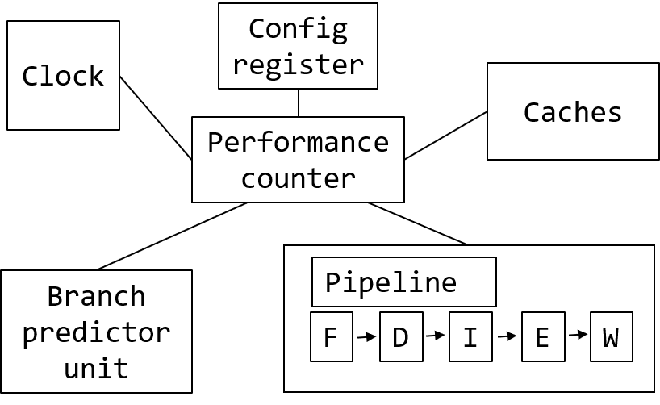

## Performance Monitoring Unit {#sec:PMU}

Every modern CPU provides means to monitor performance, which are combined into the Performance Monitoring Unit (PMU). It incorporates features that help developers in analyzing the performance of their applications. An example of a PMU in a modern Intel CPU is provided in figure @fig:PMU. Most modern PMUs have a set of Performance Monitoring Counters (PMC) that can be used to collect various performance events that happen during the execution of a program. Later in [@sec:counting], we will discuss how PMCs can be used in performance analysis. Also, there could be other features that enhance performance analysis, like LBR, PEBS, and PT, for which entire chapter 6 is devoted.

{#fig:PMU width=70%}

As CPU design evolves with every new generation, so do their PMUs. It is possible to determine the version of the PMU in your CPU using the `cpuid` command, as shown on [@lst:QueryPMU].[^1] Characteristics of each Intel PMU version, as well as changes to the previous version, can be found in [@IntelSDM, Volume 3B, Chapter 18].

Listing: Querying your PMU

~~~~ {#lst:QueryPMU .bash}
$ cpuid
...
Architecture Performance Monitoring Features (0xa/eax):
      version ID                               = 0x4 (4)
      number of counters per logical processor = 0x4 (4)
      bit width of counter                     = 0x30 (48)
...
Architecture Performance Monitoring Features (0xa/edx):
      number of fixed counters    = 0x3 (3)
      bit width of fixed counters = 0x30 (48)
...
~~~~~~~~~~~~~~~~~~~~~~~~~~~~~~~~~~~~~~~~~~~~~~~~~

### Performance Monitoring Counters {#sec:PMC}

If we imagine a simplified view of the processor, it may look something like what is shown in Figure @fig:PMC. As we discussed earlier in this chapter, a modern CPU has caches, branch predictor, execution pipeline, and other units. When connected to multiple units, a PMC can collect interesting statistics from them. For example, it can count how many clock cycles have passed, how many instructions executed, how many cache misses or branch mispredictions happened during that time, and other performance events.

{#fig:PMC width=60%}

Typically, PMCs are 48 bit wide, which allows analysis tools to run longer without interrupting the program's execution[^2]. Performance counters are HW registers implemented as Model Specific Registers (MSR). That means that the number of counters and their width can vary from model to model, and you can not rely on the same number of counters in your CPU. You should always query that first, using tools like `cpuid`, for example. PMCs are accessible via the `RDMSR` and `WRMSR` instructions, which can only be executed from kernel space.

It is so common that engineers want to count the number of executed instructions and elapsed cycles that the Intel PMU has dedicated PMCs for collecting such events. The Intel PMU has fixed and programmable PMCs. Fixed counters always measure the same thing inside the CPU core. With programmable counters, it's up to the user to choose what they want to measure. Often there are four fully programmable counters and three fixed-function counters per logical core. Fixed counters usually are set to count core clocks, reference clocks, and instructions retired (see [@sec:secMetrics] for more details on these metrics).

It's not unusual for PMU to have a large number of performance events. Figure @fig:PMU shows just a small part of all the performance events available for monitoring on a modern Intel CPU. It's not hard to notice that the number of available PMCs is much smaller than the number of performance events. It's not possible to count all the events at the same time, but analysis tools solve this problem by multiplexing between groups of performance events during the execution of a program (see [@sec:secMultiplex]). 

The complete list of performance events for Intel CPUs can be found in [@IntelSDM, Volume 3B, Chapter 19] or at [perfmon-events.intel.com](https://perfmon-events.intel.com/). For ARM chips, it is not that strictly defined. Vendors implement cores following an ARM architecture, but performance events vary widely, both in what they mean and what events are supported.

[^1]: The same information can be extracted from the kernel message buffer by using the `dmesg` command.
[^2]: When the value of PMCs overflows, the execution of a program must be interrupted. SW then should save the fact of overflow.
