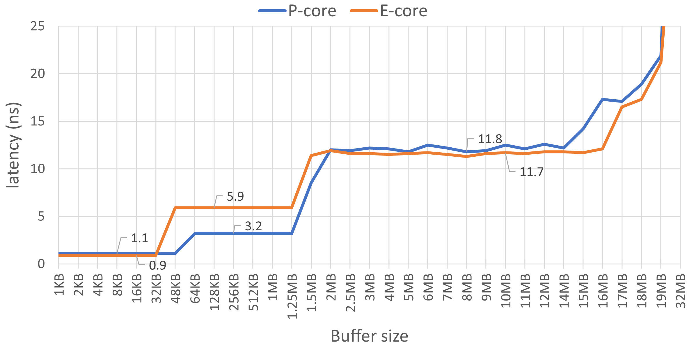

## Memory latency and bandwidth

Inefficient memory accesses are often a dominant performance bottleneck in modern environments. Thus, how quickly a processor can fetch data from the memory subsystem is a critical factor in determining application performance. There are two aspects of memory performance: 1) how fast a CPU can fetch a single byte from memory (latency), and 2) how many bytes it can fetch per second (bandwidth). Both are important in various scenarios, we will look at a few examples later. In this section, we will focus on measuring peak performance of the memory subsystem components.

One of the tools that can become helpful on x86 platforms is Intel Memory Latency Checker (MLC)[^1], which is available for free on Windows and Linux. MLC can measure cache and memory latency and bandwidth using different access patterns and under load. **TODO provide ARM and other alternatives**.

We will only focus on a subset of metrics, namely idle read latency and read bandwidth. Let's start with the read latency. Idle means that while we do the measurements, the system is idle. This will give us the minimum time required to fetch data from memory system components, but when the system is loaded by other "memory-hungry" applications, this latency increases as there may be more queueing for resources at various points. MLC measures idle latency by doing dependent loads (aka pointer chasing). A measuring thread allocates a buffer and initializes it such that each cache line (64-byte) is pointing to another line. By appropriately sizing the buffer, we can ensure that almost all the loads are hitting in certain level of cache or memory. 

Our system under test is an Intel Alderlake box with Core i7-1260P CPU and 16GB DDR4 @ 2400 MT/s single channel memory. The processor has 4P (Performance) hyperthreaded and 8E (Efficient) cores. Every P-core has 48KB of L1d cache and 1.25MB of L2 cache. Every E-core has 32KB of L1d cache, four E-cores form a cluster that has access to a shared 2MB L2 cache. All cores in the system are backed by a 18MB L3-cache. If we use a 10MB buffer, we can be certain that repeated accesses to that buffer would miss in L2 but hit in L3.

Here is the example command we use to measure 

```bash
$ ./mlc --idle_latency -c0 -L -b10m
Intel(R) Memory Latency Checker - v3.10
Command line parameters: --idle_latency -c10 -L -b10240 

Using buffer size of 10.000MiB
*** Unable to modify prefetchers (try executing 'modprobe msr')
*** So, enabling random access for latency measurements
Each iteration took 29.1 base frequency clocks (	11.7	ns)
```

{#fig:MemoryLatenciesCharts width=100% }

TODO:

- Describe the difference between memory bandwidth and latency
- Tell that latency may increase under load.
- Give examples
- Describe Intel mlc (works on Intel and AMD), give alternatives for ARM
- Give output of mlc and comment it

```bash
Measuring Peak Injection Memory Bandwidths for the system
Bandwidths are in MB/sec (1 MB/sec = 1,000,000 Bytes/sec)
Using all the threads from each core if Hyper-threading is enabled
Using traffic with the following read-write ratios
ALL Reads        :      34557.4
3:1 Reads-Writes :      30623.5
2:1 Reads-Writes :      29705.9
1:1 Reads-Writes :      29376.2
Stream-triad like:      31875.7
```


Memory latency: P-core (89.7 ns), E-core (44.9 ns)

Using similar technique we can measure bandwidth of various components of the memory hierarchy.

{#fig:MemBandwidthAndLatenciesDiagram width=100% }


- Notice, that we measure bandwidth in GB/s, thus it also depends on the frequency at which cores are running. That's why in reality, those numbers may be significantly lower. For example, L1 bw for P-core is X, when running solely on the system at full Turbo frequency. But the L1 bw for P-core may drop to 0.75X, when the system is fully loaded.
- Compare the output with maximums from Intel Advisor

If you constantly analyze performance on a single platform, it is a good idea to memorize latencies and bandwidth of various components of the memory hierarchy or have them handy. It helps to establish the mental model for a system under test which will greatly aid your further performance analysis.

[^1]: Intel MLC tool - [https://www.intel.com/content/www/us/en/download/736633/intel-memory-latency-checker-intel-mlc.html](https://www.intel.com/content/www/us/en/download/736633/intel-memory-latency-checker-intel-mlc.html)