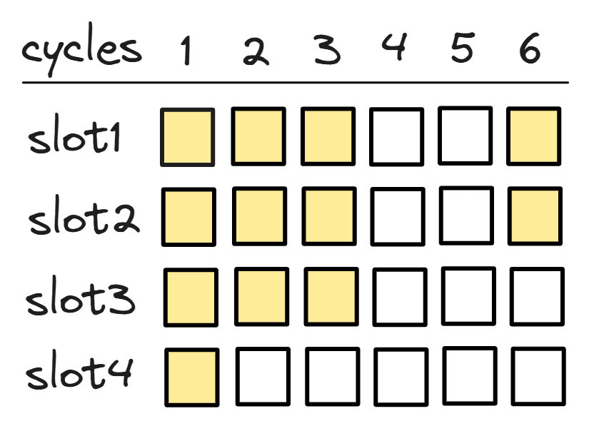

## Pipeline Slot {#sec:PipelineSlot}

Another important metric that some performance tools use is the concept of a *pipeline slot*. A pipeline slot represents the hardware resources needed to process one $\mu$op. Figure @fig:PipelineSlot demonstrates the execution pipeline of a CPU that has 4 allocation slots every cycle. That means that the core can assign execution resources (renamed source and destination registers, execution port, ROB entries, etc.) to 4 new $\mu$ops every cycle. Such a processor is usually called a *4-wide machine*. During six consecutive cycles on the diagram, only half of the available slots were utilized (highlighted in yellow). From a microarchitecture perspective, the efficiency of executing such code is only 50%.

{#fig:PipelineSlot width=40% }

Intel's Skylake and AMD Zen3 cores have a 4-wide allocation. Intel's Sunny Cove microarchitecture was a 5-wide design. As of the end of 2023, the most recent Golden Cove and Zen4 architectures both have a 6-wide allocation. Apple M1 and M2 designs 8-wide, and Apple M3 is 9-$\mu$op execution bandwidth see [@AppleOptimizationGuide, Table 4.10]. The width of a machine puts a cap on the IPC. This means that the maximum achievable IPC of a processor equals its width.[^2] For example, when your calculations show more than 6 IPC on a Golden Cove core, you should be suspicious.

Very few applications can achieve the maximum IPC of a machine. Intel Golden Cove core can theoretically execute four integer additions/subtractions, plus one load, plus one store (for a total of six instructions) per clock, but an application is highly unlikely to have the appropriate mix of independent instructions adjacent to each other to exploit all that potential parallelism.

Pipeline slot utilization is one of the core metrics in Top-down Microarchitecture Analysis (see [@sec:TMA]). For example, Frontend Bound and Backend Bound metrics are expressed as a percentage of unutilized pipeline slots due to various bottlenecks.

[^2]: Although there are some exceptions. For instance, macrofused compare-and-branch instructions only require a single pipeline slot but are counted as two instructions. In some extreme cases, this may cause IPC to be greater than the machine width.