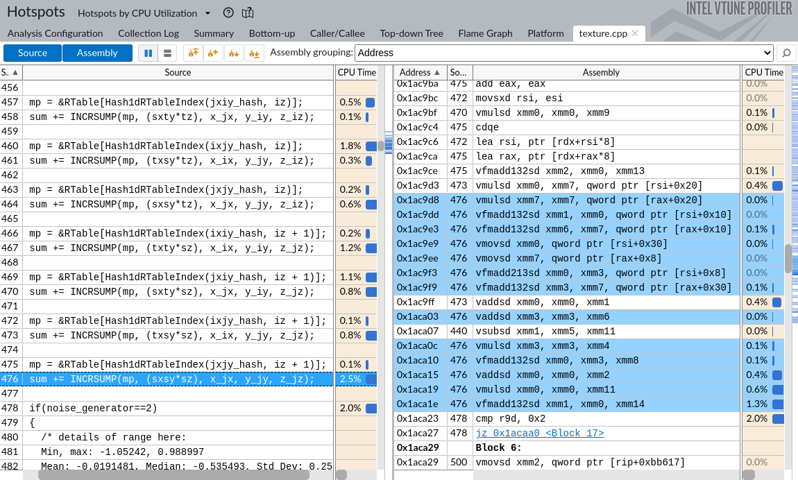
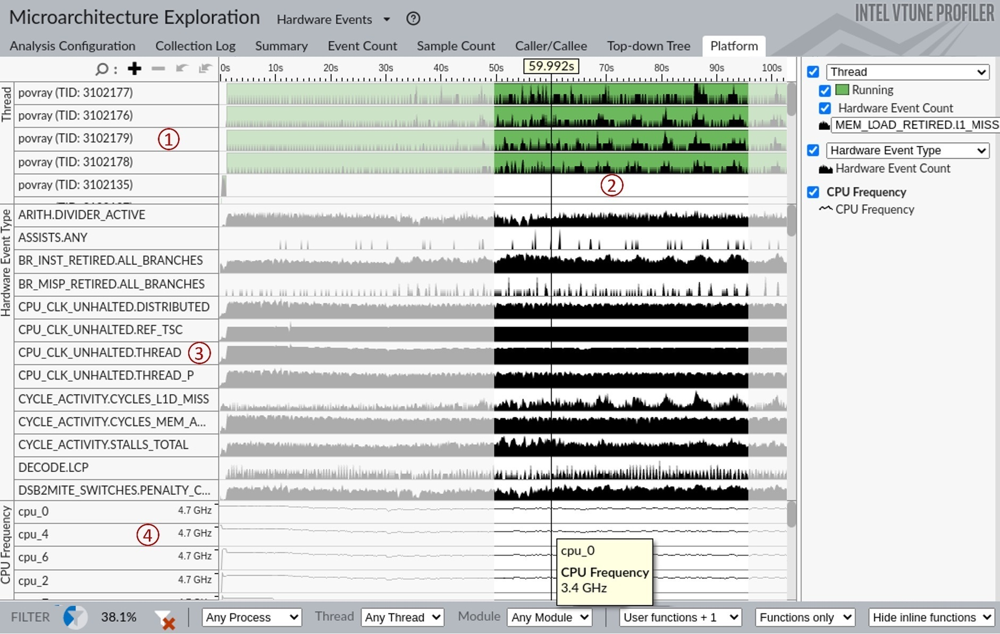
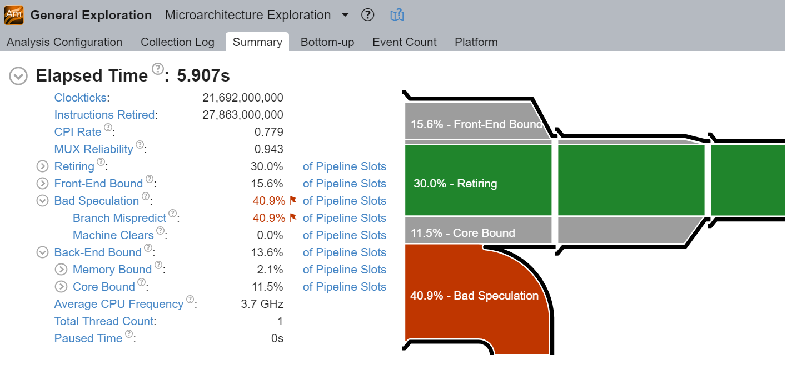
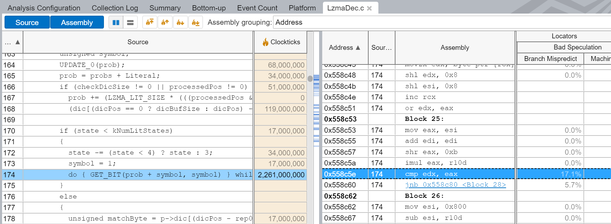

## Intel Vtune

VTune Profiler (formerly VTune Amplifier) is a performance analysis tool for x86-based machines with a rich GUI interface. It can be run on Linux or Windows operating systems. We skip discussion about MacOS support for VTune since it doesn't work on Apple's chips (e.g. M1 and M2), and Intel-based Macbooks quickly become obsolete.

Vtune can be used on both Intel and AMD systems, many features will work. However, advanced hardware-based sampling requires an Intel-manufactured CPU. For example, you won't be able to collect HW performance counters on an AMD system with Intel Vtune.

As of early 2023, VTune is available for free as a stand-alone tool or as part of the Intel oneAPI Base Toolkit.

### How to configure it {.unlisted .unnumbered}

On Linux, Vtune can use two data collectors: Linux perf and Vtune's own driver called SEP. First type is used for user-mode sampling, but if you want to perform advanced analysis, you need to build and install SEP driver, which is not too hard.

```bash
# go to the sepdk folder in vtune's installation
$ cd ~/intel/oneapi/vtune/latest/sepdk/src
# build the drivers
$ ./build-driver
# add vtune group and add your user to that group
# create a new shell, or reboot the system
$ sudo groupadd vtune
$ sudo usermod -a -G vtune `whoami`
# install sep driver
$ sudo ./insmod-sep -r -g vtune
```

After you've done with the steps above, you should be able to use adanced analysis types like Microarchitectural Exploration and Memory Access.

Windows does not require any additional configuration after you install Vtune. Collecting hardware performance events requires administrator priveleges.

### What you can do with it: {.unlisted .unnumbered}

- find hotspots: functions, loops, statements.
- monitor various CPU-specific performance events, e.g. branch mispredictions and L3 cache misses.
- locate lines of code where these events happen.
- characterize CPU performance bottlenecks with TMA methodology.
- filter data for a specific function, process, time period or logical core.
- observe the workload bahavior over time (incuding CPU frequency, memory bandwidth utilization, etc).

VTune can provide very rich information about a running process. It is the right tool for you if you're looking to improve the overall performance of an application. Vtune always provides an aggregated data over some time period, so it can be used for finding optimization opportunities for the "average case". 

### What you cannot do with it: {.unlisted .unnumbered}

- analyze very short execution anomalies.
- observe system-wide complicated SW dynamics.

Due to the sampling nature of the tool, it will eventually miss events with a very short duration (e.g. submicrosecond).

### Examples {.unlisted .unnumbered}

Below is a series of screenshots of VTune's most interesting features. For the purpose of this example, we took POV-Ray, a ray tracer that is used to create 3D graphics. Figure @fig:VtuneHotspots shows the hotpots analysis of povray 3.7 built-in benchmark, compiled with clang14 compiler with `-O3 -ffast-math -march=native -g` options, and run on Intel Alderlake system (Core i7-1260P, 4 P-cores + 8 E-cores) with 4 worker threads. 

At the left part of the image, you can see a list of hot functions in the workload along with corresponding CPU time percentage and the number of retired instructions. On the right panel, you can see one of the most frequent call stacks that lead to calling the function `pov::Noise`. According to that screenshot, `44.4%` of the time function `pov::Noise`, was called from `pov::Evaluate_TPat`, which in turn was called from `pov::Compute_Pigment`. Notice that the call stack doesn't lead all the way to the `main` function. It happens because with HW-based collection, VTune uses LBR to sample call stacks, which has limited depth. Most likely we're dealing with recursive functions here, and to investigate that further users have to dig into the code.

{#fig:VtuneHotspots width=100% }

If you double-click on `pov::Noise` function, you will see an image that is shown on the figure @fig:VtuneSourceView. For the interest of space, only the most important columns are shown. Left panel shows the source code and CPU time that corresponds to each line of code. On the right, you can see a assembly instructions along with CPU time that was attributed to them. Highlighted machine instructions correspond to line 476 in the left panel. The sum of all CPU time percentages in both panels equals to the total CPU time attributed to the `pov::Noise`, which is `26.8%`.

{#fig:VtuneSourceView width=100% }

When you use VTune to profile applications running on Intel CPUs, it can collect many different performance events. To illustrate this, we ran a different analysis type, Microarchitecture Exploration, which we already showed in the previous chapter. At that time we used it for Top-Down Microarchitectural Analysis, while we can also use it to observe raw performance events. To access raw event counts, one can switch the view to Hardware Events as shown on figure @fig:VtuneTimelineView. To enable switching views, you need to tick the mark in Options -> General -> Show all applicable viewpoints. There are two useful pages, are not shown on the image: Summary page gives you the absolute number of raw performance events as collected from CPU counters, Event Count page gives you the same data with a per-function breakdown. Readers can experiment and look at those views on their own.

Figure @fig:VtuneTimelineView is quite busy and requires some explanation. Top panel (region 1) is a timeline view that shows the behavior of our four worker threads over time with respect to L1 cache misses, plus some tiny activity of the main thread (TID: `3102135`), which spawns all the worker threads. The higher the black bar, the more events (L1 cache misses in this case) happend at any given moment. Notice ocassional spikes in L1 misses for all four worker threads. We can use this view to observe different or repeatable phases of the workload. Then to figure out which functions were executed at that time, we can select an interval and click "filter in" to focus just on that portion of the running time. Region 2 is an example of such filtering. To see the updated list of functions, you can go to Bottom Up or, in this case, Event Count view. Such filtering and zooming feature is available on all Vtune timeline views.

Region 3 shows performance events that were collected and their distribution over time. This time it is not a perf-thread view, but rather it shows aggregated data across all the threads. In addition to observing execution phases, you can also visually extract some interesting information. For example, we can see that the number of executed branches is high (`BR_INST_RETIRED.ALL_BRANCHES`), but the misprediction rate is quite low (`BR_MISP_RETIRED.ALL_BRANCHES`). This can lead you to the conclusion that branch misprediction is not a bottleneck for POV-Ray. If you scroll down, you would see that the number of L3 misses is zero, and L2 cache misses are very rare as well. This tells us that 99% of the time, memory access requests are served by L1, and the rest of them are served by L2. Two observations combined, we can conclude that the applications is likely bound by compute, i.e. CPU is busy calculating something, not waiting for memory or recovering from a misprediction.

Finally, the bottom panel (region 4) shows the CPU frequency chart for four hardware threads. Hovering over different time slices tells us that the frequency of those cores fluctuates in the 3.2GHz - 3.4GHz region. Memory Access analysis type also shows memory bandwidth in GB/s over time.

{#fig:VtuneTimelineView width=100% }

### TMA in Intel® VTune™ Profiler {.unlisted .unnumbered}

[TODO]: this section needs to be updated (moved from chapter 7).

TMA is featured through the "[Microarchitecture Exploration](https://software.intel.com/en-us/vtune-help-general-exploration-analysis)"[^3] analysis in the latest Intel VTune Profiler. Figure @fig:Vtune_GE shows analysis summary for the [7-zip benchmark](https://github.com/llvm-mirror/test-suite/tree/master/MultiSource/Benchmarks/7zip) [^4]. On the diagram, you can see that a significant amount of execution time was wasted due to CPU `Bad Speculation` and, in particular, due to mispredicted branches.

{#fig:Vtune_GE width=90%}

The beauty of the tool is that you can click on the metric you are interested in, and the tool will get you to the page that shows top functions that contribute to that particular metric. For example, if you click on the `Bad Speculation` metric, you will see something like what is shown in Figure @fig:Vtune_GE_func. [^19]

{#fig:Vtune_GE_func width=90%}

From there, if you double click on the `LzmaDec_DecodeReal2` function, Intel® VTune™ Profiler will get you to the source level view like the one that is shown in Figure @fig:Vtune_GE_code. The highlighted line contributes to the biggest number of branch mispredicts in the `LzmaDec_DecodeReal2` function.

{#fig:Vtune_GE_code width=90%}

[TODO]: Show usage of marker APIs with code and Timeline view.

[^3]: VTune microarchitecture analysis - [https://software.intel.com/en-us/vtune-help-general-exploration-analysis](https://software.intel.com/en-us/vtune-help-general-exploration-analysis). In pre-2019 versions of Intel® VTune Profiler, it was called as “General Exploration” analysis.
[^4]: 7zip benchmark - [https://github.com/llvm-mirror/test-suite/tree/master/MultiSource/Benchmarks/7zip](https://github.com/llvm-mirror/test-suite/tree/master/MultiSource/Benchmarks/7zip).
[^19]: Per-function view of TMA metrics is a feature unique to Intel® VTune profiler.