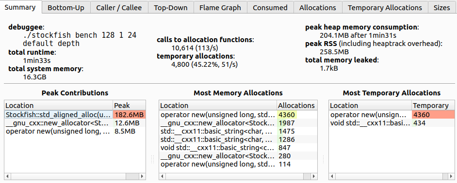
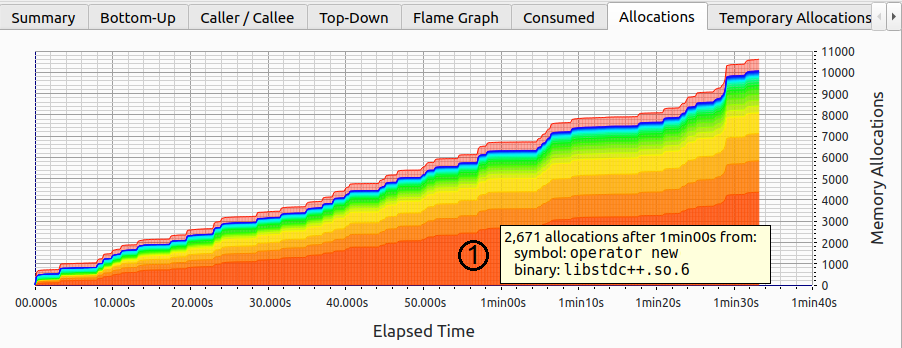
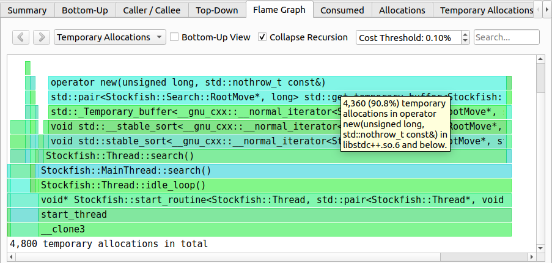
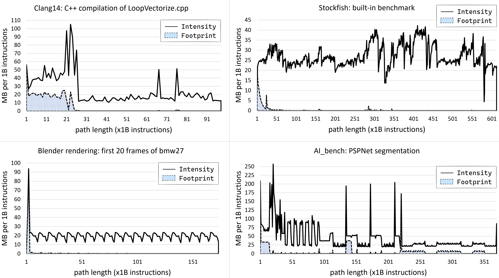

## Memory Profiling {#sec:MemoryProfiling}

So far in this chapter, we have discussed tools that identify places where a program spends most of its time. In this section, we will focus on a program's interaction with memory. This is usually called *memory profiling*. In particular, we will learn how to collect memory usage, profile heap allocations and measure memory footprint. Memory profiling helps you understand how an application uses memory over time and helps you build an accurate mental model of a program's interaction with memory. Here are some questions it can answer:

* What is a program's total virtual memory consumption and how does it change over time?
* Where and when does a program make heap allocations?
* What are the code places with the largest amount of allocated memory?
* How much memory does a program access every second?
* What is the total memory footprint of a program?

### Memory Usage

Memory usage is frequently described by Virtual Memory Size (VSZ) and Resident Set Size (RSS). VSZ includes all memory that a process can access, e.g., stack, heap, the memory used to encode instructions of an executable, and instructions from linked shared libraries, including the memory that is swapped out to disk/ssd. On the other hand, RSS measures how much memory allocated to a process resides in RAM. Thus, RSS does not include memory that is swapped out or was never touched yet by that process. Also, RSS does not include memory from shared libraries that were not loaded to memory. Files that are mapped to memory with `mmap` also contribute to VSZ and RSS usage.

Consider an example. Process `A` has 200K of stack and heap allocations of which 100K resides in the main memory; the rest is swapped out or unused. It has a 500K binary, from which only 400K was touched. Process `A` is linked against 2500K of shared libraries and has only loaded 1000K in the main memory.

```
VSZ: 200K + 500K + 2500K = 3200K
RSS: 100K + 400K + 1000K = 1500K
```

Developers can observe both RSS and VSZ on Linux with a standard `top` utility, however, both metrics can change very rapidly. Luckily, some tools can record and visualize memory usage over time. Figure @fig:MemoryUsageAIBench shows the memory usage of the PSPNet image segmentation algorithm, which is a part of the [AI Benchmark Alpha](https://ai-benchmark.com/alpha.html).[^5] This chart was created based on the output of a tool called [memory_profiler](https://github.com/pythonprofilers/memory_profiler)[^6], a Python library built on top of the cross-platform [psutil](https://github.com/giampaolo/psutil)[^7] package.

{#fig:MemoryUsageAIBench width=100%}

In addition to standard RSS and VSZ metrics, people have developed a few more sophisticated metrics. Since RSS includes both the memory that is unique to the process and the memory shared with other processes, it's not clear how much memory a process has for itself. The USS (Unique Set Size) is the memory that is unique to a process and which would be freed if the process was terminated right now. The PSS (Proportional Set Size) represents unique memory plus the amount of shared memory, evenly divided between the processes that share it. E.g. if a process has 10 MB all to itself (USS) and 10 MBs shared with another process, its PSS will be 15 MBs. The `psutil` library supports measuring these metrics (Linux-only), which can be visualized by `memory_profiler`. 

On Windows, similar concepts are defined by Committed Memory Size and Working Set Size. They are not direct equivalents to VSZ and RSS but can be used to effectively estimate the memory usage of Windows applications. The [RAMMap](https://learn.microsoft.com/en-us/sysinternals/downloads/rammap)[^8] tool provides a rich set of information about memory usage for the system and individual processes.

When developers talk about memory consumption, they implicitly mean heap usage. Heap is, in fact, the biggest memory consumer in most applications as it accommodates all dynamically allocated objects. But heap is not the only memory consumer. For completeness, let's mention others:

* Stack: Memory used by stack frames in an application. Each thread inside an application gets its own stack memory space. Usually, the stack size is only a few MB, and the application will crash if it exceeds the limit. For example, the default size of stack memory on Linux is usually 8MB, although it may vary depending on the distribution and kernel settings. The default stack size on macOS is also 8MB, but on Windows, it's only 1 MB. The total stack memory consumption is proportional to the number of threads running in the system.
* Code: Memory that is used to store the code (instructions) of an application and its libraries. In most cases it doesn't contribute much to the memory consumption, but there are exceptions. For example, the Clang 17 C++ compiler has a 33 MB code section, while the latest Windows Chrome browser has 187MB of its 219MB `chrome.dll` dedicated to code. However, not all parts of the code are frequently exercised while a program is running. We show how to measure code footprint in [@sec:CodeFootprint].

Since the heap is usually the largest consumer of memory resources, it makes sense for developers to focus on this part of memory when they analyze the memory utilization of their applications. In the following section, we will examine heap consumption and memory allocations in a popular real-world application.

### Case Study: Analyzing Stockfish's Heap Allocations {#sec:HeaptrackCaseStudy}

In this case study, we use [heaptrack](https://github.com/KDE/heaptrack)[^2], an open-sourced heap memory profiler for Linux developed by KDE. Ubuntu users can install it very easily with `apt install heaptrack heaptrack-gui`. Heaptrack can find places in the code where the largest and most frequent allocations happen among many other things. On Windows, you can use [Mtuner](https://github.com/milostosic/MTuner)[^3] which has similar capabilities to Heaptrack.

In our case study, we analyzed [Stockfish's](https://github.com/official-stockfish/Stockfish)[^4] chess engine built-in benchmark, which we have already looked at in [@sec:PerfMetricsCaseStudy]. As before, we compiled it using the Clang 15 compiler with `-O3 -mavx2` options. We collected the Heaptrack memory profile of a single-threaded Stockfish built-in benchmark on an Intel Alderlake i7-1260P processor using the following command:

```bash
$ heaptrack ./stockfish bench 128 1 24 default depth
```

Figure @fig:StockfishSummary shows us a summary view of the Stockfish memory profile. Here are some interesting facts we can learn from it:

- The total number of allocations is 10614.
- Almost half of the allocations are temporary, i.e., allocations that are directly followed by their deallocation.
- Peak heap memory consumption is 204 MB.
- `Stockfish::std_aligned_alloc` is responsible for the largest portion of the allocated heap space (182 MB). But it is not among the most frequent allocation spots (middle table), so it is likely allocated once and stays alive until the end of the program.
- Almost half of all the allocation calls come from `operator new`, which are all temporary allocations. Can we get rid of temporary allocations?
- Leaked memory is not a concern for this case study.

{#fig:StockfishSummary width=100%}

Notice, that there are many tabs on the top of the image; next, we will explore some of them. Figure @fig:StockfishMemUsage shows the memory usage of the Stockfish built-in benchmark. The memory usage stays constant at 200 MB throughout the entire run of the program. Total consumed memory is broken into slices, e.g., regions 1 and 2 on the image. Each slice corresponds to a particular allocation. Interestingly, it was not a single big 182 MB allocation that was done through `Stockfish::std_aligned_alloc` as we thought earlier. Instead, there are two: slice \circled{1} 134.2 MB and slice \circled{2} 48.4 MB. Both allocations stay alive until the very end of the benchmark. 

{#fig:StockfishMemUsage width=90%}

Does it mean that there are no memory allocations after the startup phase? Let's find out. Figure @fig:StockfishAllocations shows the accumulated number of allocations over time. Similar to the consumed memory chart (Figure @fig:StockfishMemUsage), allocations are sliced according to the accumulated number of memory allocations attributed to each function. As we can see, new allocations keep coming from not just a single place, but many. The most frequent allocations are done through `operator new` that corresponds to region \circled{1} on the image.

Notice there are new allocations at a steady pace throughout the life of the program. However, as we just saw, memory consumption doesn't change; how is that possible? Well, it can be possible if we deallocate previously allocated buffers and allocate new ones of the same size (also known as *temporary allocations*).

{#fig:StockfishAllocations width=100%}

Since the number of allocations is growing but the total consumed memory doesn't change, we are dealing with temporary allocations. Let's find out where in the code they are coming from. It is easy to do with the help of a flame graph shown in Figure @fig:StockfishFlamegraph. There are 4800 temporary allocations in total with 90.8% of those coming from `operator new`. Thanks to the flame graph we know the entire call stack that leads to 4360 temporary allocations. Interestingly, those temporary allocations are initiated by `std::stable_sort` which allocates a temporary buffer to do the sorting. One way to get rid of those temporary allocations would be to use an in-place stable sorting algorithm. However, by doing so we observed an 8% drop in performance, so we discarded this change.

{#fig:StockfishFlamegraph width=80%}

Similar to temporary allocations, you can also find the paths that lead to the largest allocations in a program. In the dropdown menu at the top, you would need to select the "Consumed" flame graph. We encourage readers to explore other tabs as well.

### Memory Intensity and Footprint {#sec:MemoryIntensityFootprint}

In this section, we will show how to measure the memory *intensity* and memory *footprint* of a program. Memory intensity refers to the size of data being accessed by a phase of a program, measured, for example, in MB per second. A program with high memory intensity makes heavy use of the memory system, often accessing large amounts of data. On the other hand, a program with low memory intensity makes relatively fewer memory accesses and may be more compute-bound, meaning it spends more time performing calculations rather than waiting for data from memory. Measuring memory intensity during short time intervals enables us to observe how it changes over time. 

Memory footprint measures the total number of bytes accessed by an application. While calculating memory footprint, we only consider unique memory locations. That is, if a memory location was accessed twice during the lifetime of a program, we count the touched memory only once.

Figure @fig:MemFootCaseStudyFourBench shows the memory intensity and footprint of four workloads: Blender ray tracing, Stockfish chess engine, Clang++ compilation, and AI_bench PSPNet segmentation. We collect data for the chart with the Intel SDE (Software Development Emulator) tool using the method described on the Easyperf [blog](https://easyperf.net/blog/2024/02/12/Memory-Profiling-Part3)[^6] with intervals of one billion instructions. 

{#fig:MemFootCaseStudyFourBench width=100%}

The solid line (Intensity) tracks the number of bytes accessed during each interval of 1B instructions. Here, we don't count how many times a certain memory location was accessed. If a memory location was loaded twice during an interval `I`, we count the touched memory only once. However, if this memory location is accessed the third time in the subsequent interval `I+1`, it contributes to the memory intensity of the interval `I+1`. Because of this, we cannot aggregate time intervals. For example, we can see that, on average, the Blender benchmark touches roughly 20MB every interval. We cannot aggregate its 150 consecutive intervals and say that the memory footprint of Blender was `150 * 20MB = 3GB`. It would be possible only if a program never repeats memory accesses across intervals.

The dashed line (Footprint) tracks the size of the new data accessed every interval since the start of the program. Here, we count the number of bytes accessed during each 1B instruction interval that have never been touched before by the program. Aggregating all the intervals (cross-hatched area under that dashed line) gives us the total memory footprint for a program. Here are the memory footprint numbers for our benchmarks: Clang C++ compilation (487MB); Stockfish (188MB); PSPNet (1888MB); and Blender (149MB). Keep in mind, that these unique memory locations can be accessed many times, so the overall pressure on the memory subsystem may be high even if the footprint is relatively small.

As you can see our workloads have very different behavior. Clang compilation has high memory intensity at the beginning, sometimes spiking to 100MB per 1B instructions, but after that, it decreases to about 15MB per 1B instructions. Any of the spikes on the chart may be concerning to a Clang developer: are they expected? Could they be related to some memory-hungry optimization pass? Can the accessed memory locations be compacted?

The Blender benchmark is very stable; we can see the start and the end of each rendered frame. This enables us to focus on just a single frame, without looking at the entire 1000+ frames. The Stockfish benchmark is a lot more chaotic, probably because the chess engine crunches different positions which require different amounts of resources. Finally, the PSPNet segmentation memory intensity is very interesting as we can spot repetitive patterns. After the initial startup, there are five or six sine waves from `40B` to `95B`, then three regions that end with a sharp spike to 200MB, and then again three mostly flat regions hovering around 25MB per 1B instructions. This is actionable information that can be used to optimize an application.

Such charts help us estimate memory intensity and measure the memory footprint of an application. By looking at the chart, you can observe phases and correlate them with the underlying algorithm. Ask yourself: "Does it look according to your expectations, or the workload is doing something sneaky?" You may encounter unexpected spikes in memory intensity. On many occasions, memory profiling helped identify a problem or served as an additional data point to support the conclusions that were made during regular profiling.

In some scenarios, memory footprint helps us estimate the pressure on the memory subsystem. For instance, if the memory footprint is small (several megabytes), we might suspect that the pressure on the memory subsystem is low since the data will likely reside in the L3 cache; remember that available memory bandwidth in modern processors ranges from tens to hundreds of GB/s and is getting close to 1 TB/s. On the other hand, when we're dealing with an application that accesses 10 GB/s and the memory footprint is much bigger than the size of the L3 cache, then the workload might put significant pressure on the memory subsystem.

While memory profiling techniques discussed in this chapter certainly help better understand the behavior of a workload, this is not enough to fully assess the temporal and spatial locality of memory accesses. We still have no visibility into how many times a certain memory location was accessed, what is the time interval between two consecutive accesses to the same memory location, and whether the memory is accessed sequentially, with strides, or completely random. The topic of data locality of applications has been researched for a long time. Unfortunately, as of early 2024, there are no production-quality tools available that would give us such information. Further details are beyond the scope of this book, however, curious readers are welcome to read the corresponding [article](https://easyperf.net/blog/2024/02/12/Memory-Profiling-Part5)[^9] on the Easyperf blog.

[^1]: Intel SDE - [https://www.intel.com/content/www/us/en/developer/articles/tool/software-development-emulator.html](https://www.intel.com/content/www/us/en/developer/articles/tool/software-development-emulator.html)
[^2]: Heaptrack - [https://github.com/KDE/heaptrack](https://github.com/KDE/heaptrack)
[^3]: MTuner - [https://github.com/milostosic/MTuner](https://github.com/milostosic/MTuner)
[^4]: Stockfish - [https://github.com/official-stockfish/Stockfish](https://github.com/official-stockfish/Stockfish)
[^5]: AI Benchmark Alpha - [https://ai-benchmark.com/alpha.html](https://ai-benchmark.com/alpha.html)
[^6]: Easyper blog: Measuring memory footprint with SDE - [https://easyperf.net/blog/2024/02/12/Memory-Profiling-Part3](https://easyperf.net/blog/2024/02/12/Memory-Profiling-Part3)
[^7]: psutil - [https://github.com/giampaolo/psutil](https://github.com/giampaolo/psutil)
[^8]: RAMMap - [https://learn.microsoft.com/en-us/sysinternals/downloads/rammap](https://learn.microsoft.com/en-us/sysinternals/downloads/rammap)
[^9]: Easyperf blog: Data Locality and Reuse Distances - [https://easyperf.net/blog/2024/02/12/Memory-Profiling-Part5](https://easyperf.net/blog/2024/02/12/Memory-Profiling-Part5)
